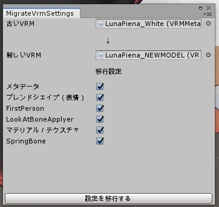

# MigrateVrmSettings
VRMの設定を古いモデルから新しいモデルに移行してくれるヤツ

  

## 概要
VRMモデルの元となったモデルを更新したとき（例えば、ウェイトを直したとき、ブレンドシェイプを増やしたとき、骨の数を増やしたとき、など）に、再度VRMの設定を行うのは骨が折れます。  
そこで古いVRMモデルの設定を、そのまま新しいVRMモデルに移行してくれるエディタ拡張を作りました。  

モデルの構成が変わっていてもなるべく移行できるように作っていますが、全て完ぺきに移行できるわけではないので、設定移行後は必ず確認をお願いします。  
また設定移行後にVRMモデルの出力をしないと設定の保存が行われません。必ずUniVRMの『Export Humanoid』を行ってください。  

## 使い方
1. BoothからUnityPackageをダウンロードしてインポートする。
2. プロジェクトのScripting Runtime Versionを .NET4.x（もしくはそれ以上） にする。
3. メニューバーより CIFER.Tech -> MigrateVrmSettings を選択する。
4. 上側に設定移行元となる古いVRMモデルを、下側に設定移行先となる新しいVRMモデルを登録する。
5. 一番下に出現する『設定を移行する』ボタンを押下する。
6. 設定が移行されたVRMモデルを出力し直す。

## 動作環境
- Unity2019.4.31f1
  - Scripting Runtime Version Experimental(.NET 4.6 Equivaient)
- [UniVRM](https://github.com/vrm-c/UniVRM)

## FAQ
### どの設定を移行してくれますか？
メタデータ、ブレンドシェイプ（表情）、FirstPerson、LookAtBoneApplyer、マテリアル／テクスチャ、SpringBone、を移行します。

## ライセンス
本リポジトリは[MITライセンス](https://github.com/karukaru808/MigrateVrmSettings/blob/master/LICENSE)の下で公開しています。  

本リポジトリにはMITライセンスの下に提供されている[UniVRM](https://github.com/vrm-c/UniVRM/blob/master/LICENSE.txt)が含まれています。  
これらのコンテンツを利用される場合は、該当リポジトリのライセンスもしくは同梱しているライセンスファイルに従ってください。
